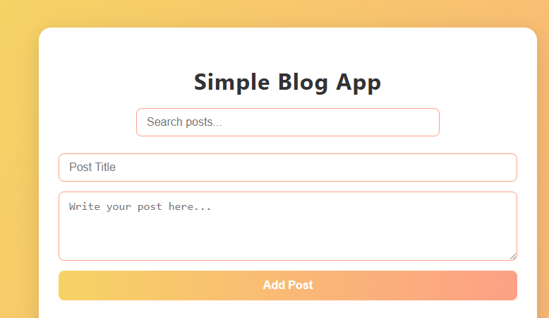
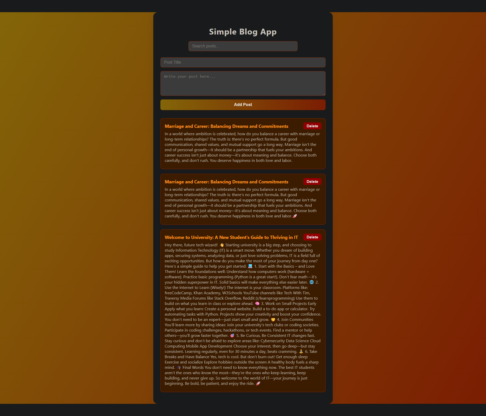

# 📝 Simple Blog Application Using Local Storage

This project demonstrates a simple blog application with the following features:
1. Search functionality for posts
2. Post title input
3. Content area for writing posts
4. Option to delete posts

Below are screenshots and a demonstration video showcasing the application's interface and functionality:

## Screenshot

## Video
<video controls src="videos/simple_blog_app - Made with Clipchamp.mp4" title="Blog Web App"></video>